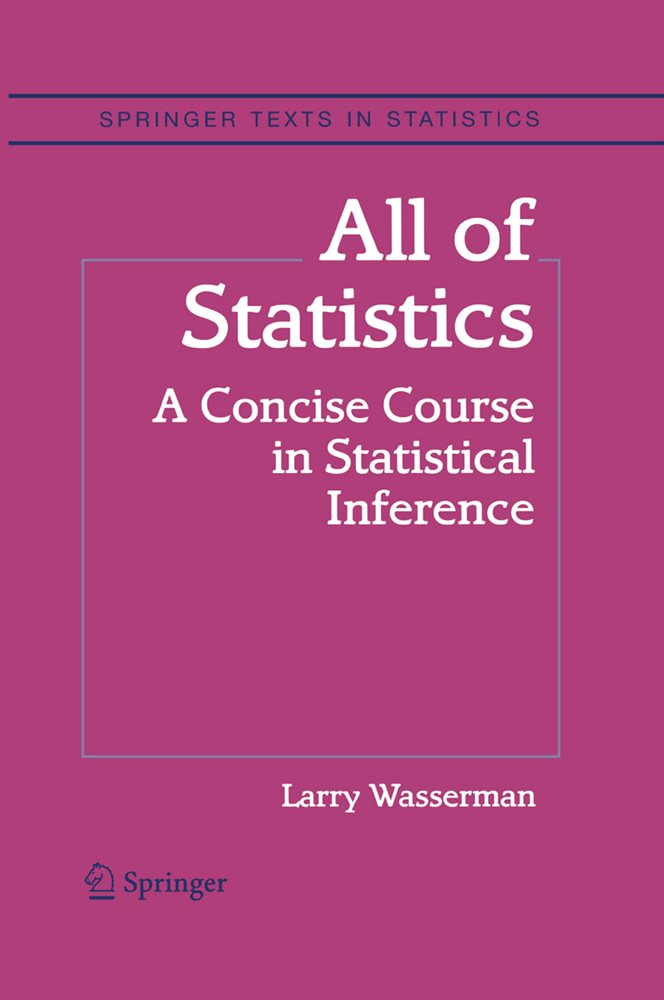

# statistics-lab-2024-25
Hands-on session on Python basics for Statistics for the course of Probability and Statistics for Engineering @ Sapienza (a.y. 2024/25)


## 📂 Repository structure


```bash
statistics-lab-2024-25/
│
├── Numpy/
│ ├── data/ # sample datasets used in the NumPy tutorials
│ ├── figures/
│ ├── 01-Introduction-to-numpy.ipynb
│ ├── 02-Understanding-types.ipynb
│ ├── 03-Basics-of-numpy-array.ipynb
│ ├── 04-Computation-on-numpy-arrays.ipynb
│ ├── 05-Computation-on-arrays-aggregates.ipynb
│ ├── 06-Computation-on-arrays-broadcasting.ipynb
│ ├── 07-Boolean-arrays-and-masks.ipynb
│ └── 08-Fancy-indexing.ipynb
│
├── Stats/
│ ├── data/ # sample datasets used in the NumPy tutorials
│ ├── 01-Exploratory-data-analysis.ipynb
│ ├── 02-Expectation.ipynb
│ ├── 03-Inequalities.ipynb
│ ├── 04-Estimating-the-CDF-and-statistical-functionals.ipynb
│ ├── 00-Examples-of-sampling-distributions.ipynb
│
├── main.py
├── pyproject.toml
└── README.md
```

## 📓 Notebooks

Below are the available Jupyter notebooks. Click the badge to launch each one directly in Google Colab.

### Numpy tutorial

1. **NumPy Intro** [](https://colab.research.google.com/github/Engrima18/statistics-lab-2024-25/blob/main/numpy/01-numpy_basics.ipynb)

2. **Numpy Basics and Types** [](https://colab.research.google.com/github/Engrima18/statistics-lab-2024-25/blob/main/numpy/02-Understanding-types.ipynb)

3. **Numpy Arrays** [](https://colab.research.google.com/github/Engrima18/statistics-lab-2024-25/blob/main/numpy/03-Basics-of-numpy-array.ipynb)

4. **Computations with Arrays 1** [](https://colab.research.google.com/github/Engrima18/statistics-lab-2024-25/blob/main/numpy/04-Computation-on-numpy-arrays.ipynb)

5. **Computations with Arrays 2** [](https://colab.research.google.com/github/Engrima18/statistics-lab-2024-25/blob/main/numpy/05-Computation-on-arrays-aggregates.ipynb)

6. **Computations with Arrays 3** [](https://colab.research.google.com/github/Engrima18/statistics-lab-2024-25/blob/main/numpy/06-Computation-on-arrays-broadcasting.ipynb)

7. **Masking Arrays** [](https://colab.research.google.com/github/Engrima18/statistics-lab-2024-25/blob/main/numpy/07-Boolean-arrays-and-masks.ipynb)

8. **Arrays Indexing** [](https://colab.research.google.com/github/Engrima18/statistics-lab-2024-25/blob/main/numpy/08-Fancy-indexing.ipynb)

### Python for Statistics tutorial

1. **Exploratory data analysis and visualization** [](https://colab.research.google.com/github/Engrima18/statistics-lab-2024-25/blob/main/stats/01-Exploratory-data-analysis.ipynb)

2. **Expectation and sample mean distribution** [](https://colab.research.google.com/github/Engrima18/statistics-lab-2024-25/blob/main/stats/02-Expectation.ipynb)

3. **Inequalities** [](https://colab.research.google.com/github/Engrima18/statistics-lab-2024-25/blob/main/stats/03-Inequalities.ipynb)

4. **Empirical distribution and non-parametric inference** [](https://colab.research.google.com/github/Engrima18/statistics-lab-2024-25/blob/main/stats/04-Estimating-the-CDF-and-statistical-functionals.ipynb)

5. **Sampling from distributions in python** [](https://colab.research.google.com/github/Engrima18/statistics-lab-2024-25/blob/main/stats/00-Examples-of-sampling-distributions.ipynb)


---

## ⚠️ Disclaimer

- The NumPy tutorials are adapted from Jake VanderPlas’s [Python Data Science Handbook](https://github.com/jakevdp/PythonDataScienceHandbook)
- The Computational Statistics tutorials and exercises are adapted the books [All of statistics](https://link.springer.com/book/10.1007/978-0-387-21736-9) by Larry Wassermann and [Practical Statistics for Data Scientists](https://github.com/gedeck/practical-statistics-for-data-scientists) by Peter C. Bruce, Andrew Bruce, Peter Gedeck
- Credits for the exercise solutions: [Telmo Correa](https://github.com/telmo-correa/all-of-statistics)

<table width='100%'>
<td></td>
  <td></td>
  <td></td>
</table>
